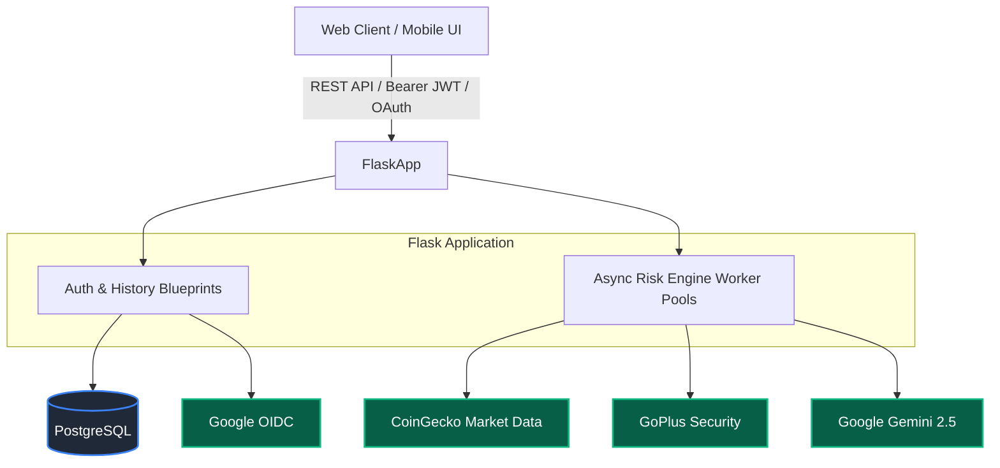

# 🛡️ CryptoRisk AI

> *An institutional-grade cryptocurrency intelligence and risk analysis platform powered by Flask, Google Gemini, and GoPlus.*

[](https://crypto-risk-ai-2.onrender.com)
[](https://www.python.org/)
[](https://flask.palletsprojects.com/)
[](LICENSE)
[](.github/workflows/ci.yml)

CryptoRisk AI synthesizes quantitative market metrics, smart contract security audits, historical drawdowns, and **Google Gemini** generative AI reasoning into a multi-pillar risk report for web3 assets.

---

## 🏗️ System Architecture



### Key Architectural Characteristics
- **Unified Service Architecture:** High-efficiency Flask backend serving both modular RESTful API endpoints and static SPA frontend.
- **Asynchronous Execution Pipeline:** Thread pool executors decouple compute-heavy multi-provider fetches from web request threads, returning immediate job IDs with polled progress updates.
- **Multi-Tier Fault Tolerance:** In-memory caching with graceful stale-snapshot fallbacks, automatic rate-limit cooldown management, and defensive parsing guarantees high uptime during external provider degraded states.
- **Strict Security & Authentication:** Passwords hashed with standard `bcrypt`, tamper-proof HS256 JWT sessions, Google OAuth 2.0 integration, and parameterized PostgreSQL queries via connection pooling.

---

## 🛠️ Technology Stack

| Layer | Technology |
| :--- | :--- |
| **Frontend** | Vanilla JavaScript (ES Modules), Custom Modern CSS3 (Dark Luxury Theme), HTML5 |
| **Backend** | Python 3.10+, Flask, Gunicorn (`gthread` async worker model) |
| **Database** | PostgreSQL with `psycopg2` Threaded Connection Pool & `pgcrypto` UUIDs |
| **Authentication** | JSON Web Tokens (`PyJWT`), Google OAuth 2.0 (`Authlib`), `bcrypt` |
| **Market Intelligence**| CoinGecko API (Demo / Pro) |
| **Contract Security**| GoPlus Token Security API (EVM Chain Analysis) |
| **Generative AI** | Google Gemini API (`gemini-2.5-flash`) |

---

## ⚡ Core Features

- **Multi-Pillar Risk Scoring:** Calculates composite risk index (0–100) combining Volatility, Liquidity, Market Sensitivity (Beta), and Smart Contract Integrity.
- **Contract Security Scanning:** Automatically analyzes EVM token contracts for honeypots, exorbitant buy/sell taxes, blacklisting capabilities, and ownership privileges via GoPlus.
- **Native Asset Awareness:** Automatically identifies Layer-1 native assets (BTC, ETH, SOL, AVAX, etc.) and adjusts audit criteria accordingly.
- **AI Executive Risk Synthesis:** Employs Google Gemini to analyze multi-source data and output structured executive summaries, risk regime assessments, and critical watch items.
- **Interactive Analysis History:** User analysis history is securely stored in PostgreSQL with collapsible inspection drawers and real-time live market updates.

---

## 📂 Project Structure

```text
Crypto-Risk-AI/
├── backend/                     # Server-side domain, APIs, and business logic
│   ├── app.py                   # Application factory & blueprint registration
│   ├── config.py                # Environment configuration & provider settings
│   ├── extensions.py            # DB connection pool, OAuth, and executor setup
│   ├── pre_start.py             # Pre-deployment database migrations & schema setup
│   ├── gunicorn.conf.py         # Production WSGI server configuration
│   ├── requirements.txt         # Pinned Python production dependencies
│   ├── routes/                  # Modular Flask blueprints (auth, risk, market, history)
│   ├── services/                # Quantitative risk engine, CoinGecko, GoPlus, Gemini AI
│   └── utils/                   # Telemetry helpers, mathematical statistics, error models
│
├── frontend/                    # Presentation layer and client application
│   ├── static/                  # Static frontend assets
│   │   ├── style.css            # Dark luxury design system & responsive layout
│   │   └── js/                  # ES modules (state store, API clients, UI components)
│   └── templates/               # Jinja2 templates
│       ├── index.html           # Landing & authentication page
│       └── dashboard.html       # Analytics dashboard & interactive terminal
│
├── tests/                       # Pytest test suites (Auth, Risk Engine)
├── docs/screenshots/            # UI screenshots for README
├── app.py                       # Root application entrypoint proxy
├── wsgi.py                      # Root WSGI server callable for Gunicorn
├── pre_start.py                 # Root pre-deployment migration bridge
├── gunicorn.conf.py             # Root Gunicorn server configuration
├── requirements.txt             # Root dependency pointer for Render builds
├── render.yaml                  # Render deployment configuration
└── .env.example                 # Configuration template
```

---

## 🚀 Getting Started

### Prerequisites
- Python 3.10+
- PostgreSQL database (local or cloud provider such as Supabase, Neon, or Render)
- Google Gemini API Key
- CoinGecko API Key (Demo or Pro)

### 1. Clone & Configure Environment

```bash
git clone https://github.com/chetanaybuilder/Crypto-Risk-AI.git
cd Crypto-Risk-AI
cp .env.example .env
```

Edit `.env` and provide your credentials (reference the Environment Variables table below).

### 2. Install Dependencies

```bash
python -m venv .venv
# On Windows:
.venv\Scripts\activate
# On macOS/Linux:
source .venv/bin/activate

pip install -r backend/requirements.txt
```

### 3. Initialize Database

Run the database migration and schema setup:

```bash
python pre_start.py
```

### 4. Run Development Server

```bash
python app.py
```

Navigate to `http://localhost:5000` in your browser.

---

## 🔒 Environment Variables Reference

| Variable | Description |
| :--- | :--- |
| `FLASK_ENV` | Environment (`development` or `production`) |
| `SECRET_KEY` | Secure random key for Flask sessions |
| `JWT_SECRET_KEY` | Secure key for signing JSON Web Tokens |
| `DATABASE_URL` | PostgreSQL connection string |
| `GEMINI_API_KEY` | Key for Google Gemini 2.5 API |
| `COINGECKO_API_KEY`| Key for CoinGecko |
| `COINGECKO_PLAN` | Plan tier (`demo` or `pro`) |

---

## 🌐 API Endpoint Reference

| Method | Endpoint | Description |
| :--- | :--- | :--- |
| `GET` | `/health` | System diagnostics and liveness probe |
| `POST` | `/api/auth/signup` | Register new user account |
| `POST` | `/api/auth/login` | Authenticate user |
| `GET` | `/api/auth/google` | Trigger Google OAuth 2.0 flow |
| `POST` | `/api/risk/analyze` | Submit an asset for risk analysis |
| `GET` | `/api/risk/job/<job_id>` | Poll analysis job status |
| `GET` | `/api/history` | Retrieve user's analysis history |

---

## 📊 Risk Methodology

The engine calculates risk based on several independent pillars:

1. **Market Risk:** Focuses on drawdowns (difference between ATH and current price) and volatility.
2. **Liquidity Risk:** Analyzes 24h trading volume against fully diluted valuation / market cap.
3. **Security Risk (GoPlus):** Static analysis of the contract (e.g. mintable flags, proxy logic, honeypot potential, buy/sell taxes).
4. **AI Synthesis:** Google Gemini correlates these structured data points against current market sentiment and macro regimes.

---

## 📸 Screenshots

*(Replace placeholders with actual UI screenshots from `docs/screenshots/`)*


*The main analytics dashboard showing multi-pillar risk scoring.*


*Async polling interface updating real-time job status.*

---

## 🧪 Testing and CI

This repository uses `pytest` for testing the risk engine logic, API routes, and authentication securely via mocked data.

To run tests:
```bash
pip install -e .[dev]
pytest tests/
```

We utilize GitHub Actions (`.github/workflows/ci.yml`) to enforce code formatting (`black`), linting (`ruff`), and testing on every pull request.

---

## 🗺️ Roadmap & Contributing

Please read the [CONTRIBUTING.md](CONTRIBUTING.md) and [SECURITY.md](SECURITY.md) guidelines before issuing a Pull Request.

**Future Items:**
- On-chain active liquidity pool analysis (Uniswap V3)
- Multi-chain deployment support for Solana and Avalanche
- Advanced charting for tokenomics vesting schedules

---

## ⚠️ Disclaimer

**Educational Tool, Not Financial Advice.** This platform is designed solely to aggregate and synthesize data. Cryptocurrencies are highly volatile and inherently risky. Use at your own risk.

---

**Author:** [chetanaybuilder](https://github.com/chetanaybuilder)
